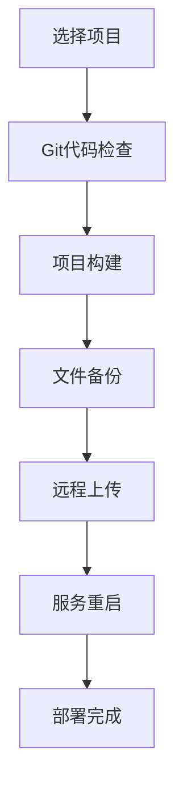

# 自动化部署工具

一款本地运行的可视化自动化部署工具，支持 SpringBoot 后端项目与 Vue3 前端项目的全流程自动化部署。

## ✨ 功能特性

- 🚀 **一键部署**: SpringBoot + Vue3 项目全流程自动化
- 📁 **智能识别**: 自动检测项目类型和构建工具
- 🌿 **分支控制**: Git 分支选择与状态检查
- 📦 **多构建支持**: Maven/Gradle/npm 构建工具支持
- 🔐 **安全上传**: SSH 远程文件传输和备份
- 🔄 **服务管理**: 远程服务重启与 Nginx 重载
- 💾 **配置存储**: SQLite 本地化配置管理
- 📊 **历史记录**: 详细的部署日志与统计分析
- 🎯 **实时监控**: WebSocket 实时构建日志推送
- 🛡️ **安全保障**: 敏感信息加密存储

## 🛠 技术栈

### 前端
- **Vue3** + **Element Plus** + **Vite**
- **Pinia** (状态管理) + **Vue Router** (路由)
- **Axios** (HTTP客户端)

### 后端  
- **Node.js** + **Express** (API服务)
- **SQLite** (轻量级数据库)
- **SSH2** (远程连接) + **Child Process** (命令执行)

### 支持的构建工具
- **Maven**: SpringBoot 项目构建
- **Gradle**: SpringBoot 项目构建  
- **NPM**: Vue3 项目构建

## 🚀 快速开始

### 环境要求
- Node.js 20.14+ (推荐 20.19+)
- Git (代码管理)
- Maven/Gradle (可选，用于Java项目)

### 安装启动

1. **克隆项目**
```bash
git clone [项目地址]
cd deploy-tools
```

2. **安装依赖**
```bash
npm install
```

3. **初始化数据库**
```bash
cd backend && npm run init-db
```

4. **启动服务**
```bash
# 开发环境（同时启动前后端）
npm run dev

# 生产环境
npm run build  # 构建前端
npm start      # 启动后端
```

5. **访问应用**
- 应用地址: http://localhost:3001
- API接口: http://localhost:3001/api
- 健康检查: http://localhost:3001/api/health

## 📖 使用指南

### 基本配置流程

1. **项目配置**
   - 添加 SpringBoot 或 Vue3 项目路径
   - 系统自动检测项目类型和构建工具
   - 配置 Git 分支信息

2. **服务器配置**  
   - 配置远程服务器连接信息
   - 支持密码和私钥两种认证方式
   - 设置文件上传路径和重启脚本

3. **执行部署**
   - 选择项目和目标服务器
   - 选择部署类型（后端/前端/全部）
   - 一键执行完整部署流程

### 部署流程



## 🏗 项目结构

```
deploy-tools/
├── backend/                 # Node.js 后端服务
│   ├── src/
│   │   ├── controllers/     # API 控制器
│   │   ├── services/        # 业务服务层
│   │   ├── models/          # 数据模型
│   │   ├── config/          # 配置文件
│   │   └── app.js          # 应用入口
│   ├── database/           # SQLite 数据库
│   └── package.json
├── frontend/               # Vue3 前端应用
│   ├── src/
│   │   ├── components/     # Vue 组件
│   │   ├── views/         # 页面视图
│   │   ├── stores/        # Pinia 状态
│   │   └── main.js        # 应用入口
│   ├── public/            # 静态资源
│   └── package.json
├── docs/                  # 项目文档
│   ├── README.md         # 详细使用文档
│   └── QUICK_START.md    # 快速启动指南
└── package.json          # 根配置文件
```

## 🔌 API 接口

### 核心接口
- `GET /api/health` - 健康检查
- `GET /api/system/info` - 系统信息
- `GET /api/projects` - 项目配置管理
- `GET /api/servers` - 服务器配置管理
- `POST /api/deploy/execute` - 执行部署
- `GET /api/history` - 部署历史

### WebSocket 支持
- 实时构建日志推送
- 部署状态更新
- 错误信息提醒

## 📊 数据库设计

### 核心表结构
- **project_config**: 项目配置信息
- **server_config**: 服务器配置信息
- **deploy_record**: 部署历史记录

### 数据特性
- 敏感信息加密存储
- 配置历史版本管理
- 部署日志完整记录
- 统计分析数据支持

## 🔧 高级功能

### 构建优化
- 跳过测试用例 (`-Dmaven.test.skip=true`)
- 增量构建支持
- 并行化处理
- 构建缓存机制

### 部署安全
- 自动文件备份 (`.bak.时间戳`)
- 部署前状态检查
- 回滚支持
- 权限验证

### 监控告警
- 部署状态实时监控
- 失败自动告警
- 性能指标统计
- 日志分析工具

## 🛠 开发指南

### 本地开发
```bash
# 启动后端开发服务
cd backend && npm run dev

# 启动前端开发服务
cd frontend && npm run dev
```

### 代码规范
- ESLint + Prettier 代码格式化
- Git Hooks 提交检查
- 单元测试覆盖
- API 文档同步

### 扩展开发
- 新增构建工具支持
- 自定义部署流程
- 第三方集成开发
- 插件化架构

## 📋 计划特性

- [ ] Docker 容器化部署
- [ ] 多环境配置管理
- [ ] CI/CD 流水线集成
- [ ] 微服务部署支持
- [ ] 集群部署管理
- [ ] 监控告警系统
- [ ] 移动端管理界面
- [ ] 插件生态系统

## 🤝 贡献指南

欢迎提交 Issue 和 Pull Request！

1. Fork 项目
2. 创建特性分支 (`git checkout -b feature/AmazingFeature`)
3. 提交更改 (`git commit -m 'Add some AmazingFeature'`)
4. 推送分支 (`git push origin feature/AmazingFeature`)
5. 创建 Pull Request

## 📄 许可证

本项目采用 MIT 许可证 - 查看 [LICENSE](LICENSE) 文件了解详情

## 📞 支持

- 📖 [详细文档](./docs/README.md)
- 🚀 [快速启动](./docs/QUICK_START.md)
- 🐛 [问题反馈](../../issues)
- 💬 [讨论交流](../../discussions)

---

**开始您的自动化部署之旅！** 🎉